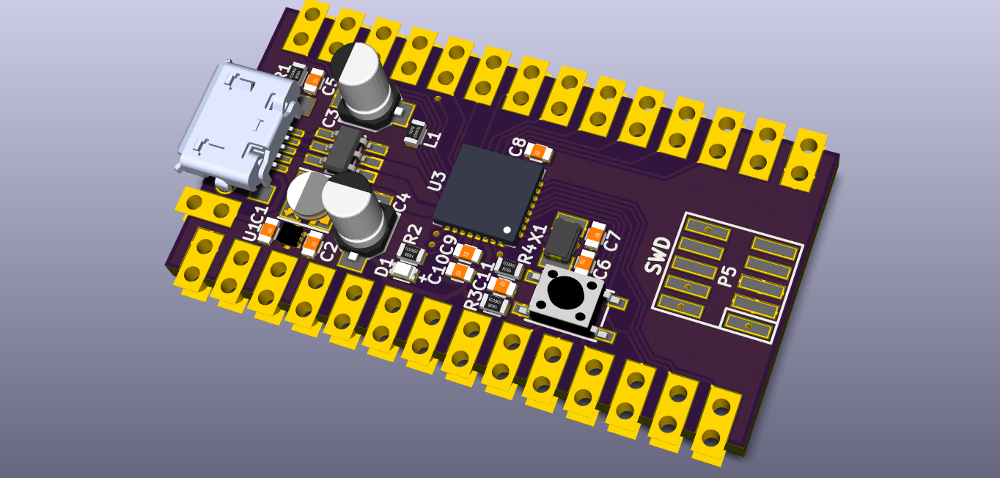
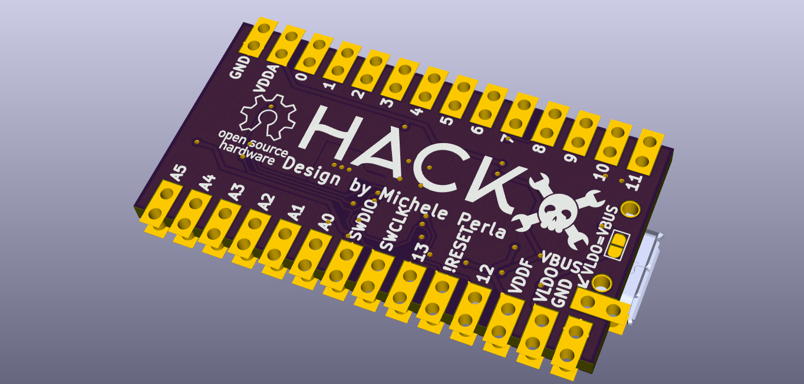

#HACK
##HackAday Cortex Kit

A Cortex-M0+ development kit with an Atmel SAM R21, a USB device/host port, a regulator, some passives, a programming header, and breakout headers.





```
Copyright © Michele Perla 2015

This documentation describes Open Hardware and is licensed under the CERN OHL v. 1.2.
You may redistribute and modify this documentation under the terms of the CERN OHL v.1.2. 
(http://ohwr.org/cernohl). This documentation is distributed
WITHOUT ANY EXPRESS OR IMPLIED WARRANTY, INCLUDING OF
MERCHANTABILITY, SATISFACTORY QUALITY AND FITNESS FOR A
PARTICULAR PURPOSE. Please see the CERN OHL v.1.2 for applicable
conditions
```
